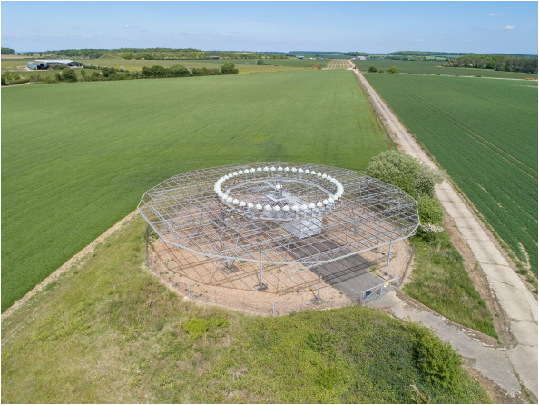

# VHF-Omnidirectional-Range

108 – 117,5 MHz frekans bandında çalışan VOR’lar genel olarak ses iletimi de yapabilirler. (VORW hariç.) Mors kodu veya önceden kaydedilmiş ATIS gibi ses kayıtları ile tanımlanabilirler. VOR’ların hata payı çok düşüktür. (-/+ 1 derece kadar) Ancak bazı motor devri ve helikopter hızları bu hata payını 6 dereceye kadar yükseltebilir. Bazı VOR istasyonlarında (en fazla dağlık arazide olanlarda) ani sapma veya rota pürüzlülükleri gözlemlenebilir. Bu yüzden verilerilerin sürekli kontrol edilmesi gerekmektedir. PBN kademeli olarak VOR’lara dayalı prosedürlerin ve rotaların yerine geçmektedir. PBN prosedürlerinin navigasyon dayanağı ana olarak GPS ve GNSS’tir. DME (Distance Measurement Equipment) taşıyan uçaklar, herhangi bir GPS kesintisi veya GPS Spoofing (Bu makalede bahsedilmeyecektir.) olması durumunda RNAV’I de kullanabilir. Ama DME ekipmanı bulunmayan uçaklar için bu mümkün değildir. Bu yüzden günümüzde hala VOR MON (Minimum Operation Network) yürürlüktedir. Böylece her uçak GNSS kesintisi sırasında en yakın MON havalimanına yaklaşabilmektedir.

VOR’un çalışma prensibi iki sinüs dalgasına dayalıdır: referans sinyali (S_ref) ve değişken sinyal (S_var). Uçağın bulunduğu manyetik kuzeye göre olan açısındaki () fonksiyonel temsil şöyledir:
S_ref (t)=sin⁡(2πft)  S_var (t)=sin⁡〖(2πft-θ)〗
Bu iki sinüs dalgası arasındaki faz farkı ölçülerek de uçağın hangi radyalde olduğu saptanabilir.

